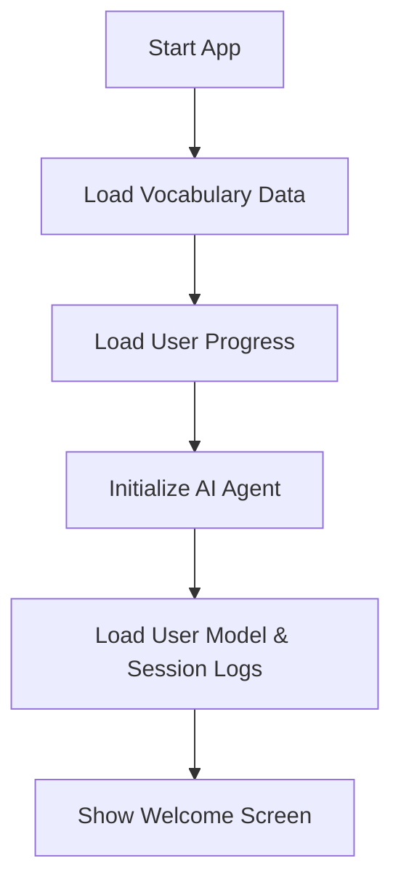
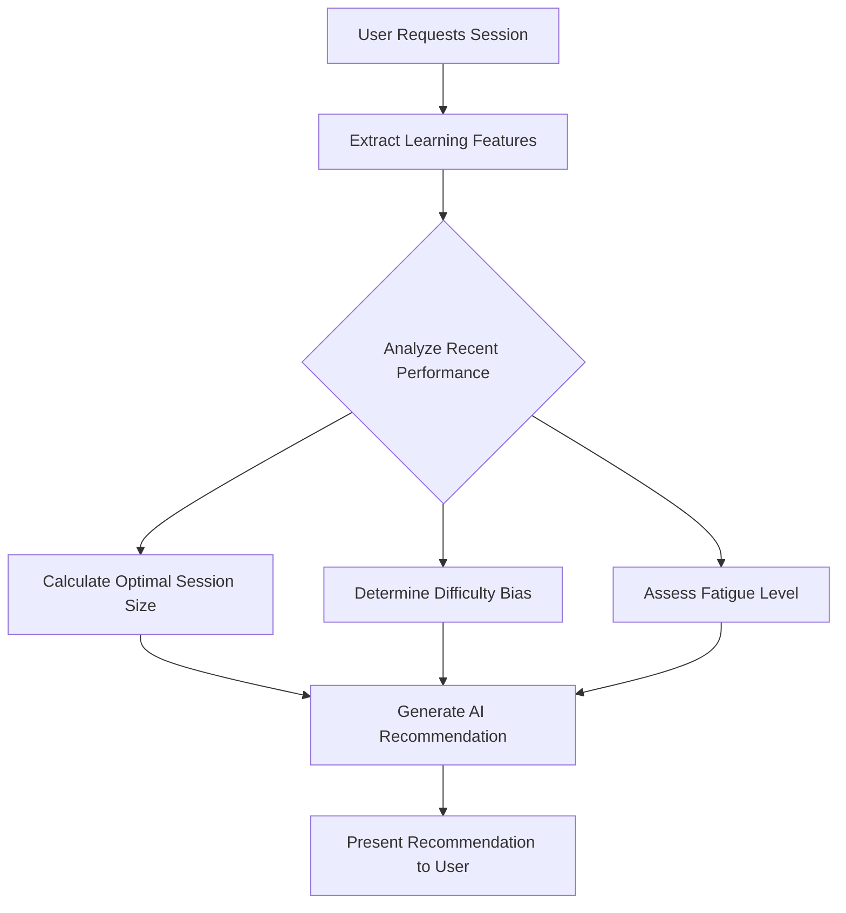
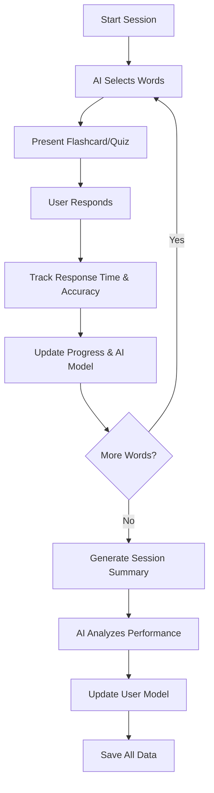

# 🤖 AI-Enhanced Spanish Vocabulary Learning App

An intelligent vocabulary trainer that adapts to your learning patterns using AI-powered personalization and spaced repetition techniques.

## 🌟 Features

### Adaptive Learning Intelligence
- **Personalized AI Agent**: Learns your unique learning patterns and adapts session difficulty
- **Smart Session Planning**: AI recommends optimal session sizes and word selections
- **Performance Prediction**: Anticipates your performance and adjusts accordingly
- **Fatigue Detection**: Monitors accuracy drops and prevents cognitive overload

### Advanced Spaced Repetition
- **Personalized Leitner System**: Adapts review intervals based on your individual forgetting curve
- **Dynamic Scheduling**: Words appear for review based on your personal success rates
- **Box-Level Progression**: Words advance through mastery levels (1-5) with personalized timing

### Comprehensive Progress Tracking
- **Response Time Analytics**: Tracks and analyzes your thinking speed patterns
- **Accuracy Trends**: Monitors performance over time with trend analysis
- **Mastery Distribution**: Visual breakdown of your vocabulary strength levels
- **Session History**: Detailed logs of all learning sessions with AI insights

## 📋 Requirements

### Python Dependencies
```bash
pip install tkinter numpy
```

### Required Files
- `english_spanish.csv` - Your vocabulary dataset
- Python 3.7+ with tkinter support

### CSV Format
Your vocabulary file should have columns for English and Spanish words:
```csv
english,spanish
hello,hola
goodbye,adiós
thank you,gracias
```

## 🚀 Quick Start

1. **Prepare your vocabulary file**:
   - Create `english_spanish.csv` with your word pairs
   - Ensure proper UTF-8 encoding for Spanish characters

2. **Run the application**:
   ```bash
   python vocabulary_app.py
   ```

3. **Start learning**:
   - The AI will analyze your progress and recommend an optimal session
   - Follow the AI's guidance for best results

## 🧠 How the AI Adaptation Works

### 1. User Modeling
The AI builds a comprehensive model of your learning characteristics:

```python
user_model = {
    "forgetting_curve_params": {"a": 0.9, "b": 1.2},  # Personal forgetting curve
    "optimal_session_sizes": [12, 16, 20],             # Preferred session sizes
    "fatigue_threshold": 0.7,                          # Accuracy drop indicating fatigue
    "response_time_baseline": 3.0,                     # Average response time
    "accuracy_trends": [0.85, 0.92, 0.88, ...],      # Performance history
    "confidence_level": 0.8                            # AI's confidence in predictions
}
```

### 2. Feature Extraction
For each session, the AI analyzes multiple factors:
- **Recent Performance**: Your accuracy in the last 3-5 sessions
- **Response Time Trends**: How quickly you're answering questions
- **Fatigue Indicators**: Within-session accuracy drops
- **Forgetting Patterns**: How often you forget previously learned words
- **Time Since Last Session**: Days/hours since your last practice

### 3. Intelligent Decision Making
Based on extracted features, the AI makes real-time decisions:

#### Session Size Optimization
```python
# Example AI logic
if recent_accuracy >= 0.85:
    session_size = base_size * 1.3  # Challenge with more words
elif fatigue_detected:
    session_size = base_size * 0.8  # Reduce cognitive load
```

#### Word Selection Strategy
- **Challenging Mode**: 50% new words, focus on difficult vocabulary
- **Review Heavy**: 50% struggling words, reinforce weak areas
- **Balanced Mode**: 40% new, 30% struggling, 25% progressing
- **Easy Mode**: Emphasis on confidence building

#### Personalized Spaced Repetition
```python
# Traditional: Fixed intervals (1, 2, 4, 7, 15 sessions)
# AI-Enhanced: Personalized based on your success rate
if word_success_rate >= 0.9:
    interval_multiplier = 1.5  # Extend interval
elif word_success_rate < 0.7:
    interval_multiplier = 0.6  # Shorten interval
```

## 🔄 Application Workflow

### Initial Setup


### AI-Powered Session Planning


### Adaptive Learning Loop


## 📊 Data Files Generated

The app creates several files to track your progress and AI learning:

- **`vocab_progress.json`**: Your individual word progress and statistics
- **`session_counter.json`**: Session numbering and tracking
- **`user_model.json`**: AI's model of your learning patterns
- **`ai_learning_logs.json`**: Detailed session logs for AI improvement

## 🎯 Adaptive Features in Detail

### Dynamic Difficulty Adjustment
- **Performance Monitoring**: Tracks accuracy trends over multiple sessions
- **Cognitive Load Management**: Reduces session size when fatigue is detected
- **Optimal Challenge Zone**: Maintains difficulty at your personal sweet spot

### Personalized Forgetting Curves
- **Individual Patterns**: Learns how quickly YOU forget different words
- **Custom Intervals**: Adjusts review timing based on your specific retention rates
- **Success Prediction**: Anticipates which words you're likely to forget

### Intelligent Word Selection
- **Weakness Detection**: Identifies and prioritizes your problem areas
- **Strength Building**: Balances challenge with confidence-building exercises
- **New Word Introduction**: Paces new vocabulary based on your absorption rate

### Real-time Adaptation
- **Session Adjustments**: Modifies difficulty mid-session if needed
- **Response Time Analysis**: Adapts to your thinking speed patterns
- **Fatigue Prevention**: Stops sessions before cognitive overload occurs

## 🔧 Customization

### Adjusting AI Sensitivity
You can modify the AI's behavior by editing the base parameters in the code:
- `BASE_LEITNER_SCHEDULE`: Adjust base review intervals
- `fatigue_threshold`: Change fatigue detection sensitivity
- `confidence_level`: Modify AI confidence in its predictions

### Adding New Vocabulary
Simply add new word pairs to your `english_spanish.csv` file and restart the app.

## 📈 Performance Insights

The AI provides detailed feedback including:
- **Session Analysis**: How well the AI predicted your performance
- **Learning Velocity**: How quickly you're acquiring new vocabulary
- **Retention Metrics**: How well you're remembering previously learned words
- **Optimization Suggestions**: Personalized recommendations for improvement

## 🤝 Contributing

This is a sophisticated learning system that can be extended with:
- Support for additional languages
- Machine learning model improvements
- Advanced analytics and visualizations
- Web-based interface
- Mobile app adaptation

## 📝 License

This project is open source and available under the MIT License.

## 🚨 Troubleshooting

### Common Issues
1. **CSV Loading Error**: Ensure your vocabulary file uses UTF-8 encoding
2. **Missing Dependencies**: Install required packages with `pip install tkinter numpy`
3. **Performance Issues**: Large vocabulary sets (>5000 words) may need optimization

### Getting Help
- Check that all required files are in the same directory
- Verify your CSV file format matches the expected structure
- Ensure Python 3.7+ is installed with tkinter support

---

**Happy Learning! 🎓** The AI is designed to make your Spanish vocabulary acquisition as efficient and personalized as possible.
